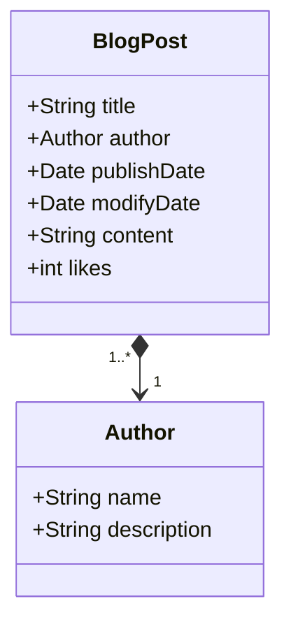

# Personal Blogging Platform API
Java RESTful API for learning purposes.

## Habilidades e Tecnologias Utilizadas
- Java
- Spring Boot
- CRUD
- Banco de Dados (PostgreSQL e H2)
- Server-side RESTful API
- Railway

## Diagrama de Classes

